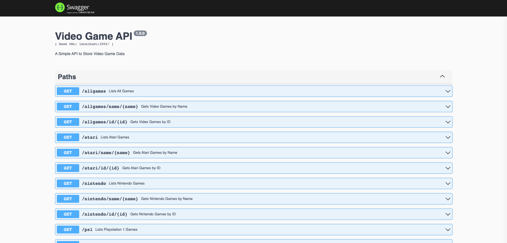

# Video Game API



### [github.com/evRook/API-Project](https://github.com/evRook/API-Project)

<br/>

## About:

<p>
This is a simple API built with express and mongoose for current and past video games.
</p>

<br/>

## Setup:
- Fork and clone this repository
- cd into the Video-Games-API directory:
``` 
$ cd Video-Games-API 
```
- Install dependencies:
``` 
$ npm install express
$ npm install mongoose
$ npm install swagger-ui-express -S 
$ npm install swagger-jsdoc 
```
- Seed the data:
```
$ node lib/db/seed.js
```
- Launch server: 
```
$ node lib/app.js
```
<br/>

## API Navigation:

#### Server will be running on [Localhost:3000](http://localhost:3000/)

<br/>

### READ

| Method | Path | Description |
| --- | --- | --- |
| `GET` | `/` | Documentation | 
| `GET` | `/allgames` | All Games |
| `GET` | `/allgames/name/{name}` | All Games by Name |
| `GET` | `/allgames/id/{id}` | All Games by ID |
| `GET` | `/atari` | All Atari Games | 
| `GET` | `/atari/name/{name}` | Atari Games by Name |
| `GET` |  `/atari/id/{id}` | Atari Games by ID |
| `GET` | `/nintendo` | All Nintendo Games |
| `GET` | `/nintendo/name/{name}` | Nintendo Games by Name |
| `GET` | `/nintendo/id/{id}` | Nintendo Games by ID |
| `GET` | `/ps1` | All Playstation 1 Games |
| `GET` | `/ps1/name/{name}` | Playstation 1 Games by Name |
| `GET` | `/ps1/id/{id}` | Playstation 1 Games by ID |
| `GET` | `/ps2` | All Playstation 2 Games |
| `GET` | `/ps2/name/{name}` | Playstation 2 Games by Name |
| `GET` | `/ps2/id/{id}` | Playstation 2 Games by ID |
| `GET` | `/ps4` | All Playstation 4 Games |
| `GET` | `/ps4/name/{name}` | Playstation 4 Games by Name |
| `GET` | `/ps4/id/{id}` | Playstation 4 Games by ID |
| `GET` | `/xbox` | All Xbox Games |
| `GET` | `/xbox/name/{name}` | Xbox Games by Name |
| `GET` | `/xbox/id/{id}` | Xbox Games by ID |

<br/>

### CREATE

| Method | Path | Description |
| --- | --- | --- |
| `POST` | `/allgames` | Create New Entry in All Games | 
| `POST` | `/atari` | Create New Entry in Atari | 
| `POST` | `/nintendo` | Create New Entry in Nintendo |
| `POST` | `/ps1` | Create New Entry in PS1 |
| `POST` | `/ps2` | Create New Entry in PS2 |
| `POST` | `/ps4` | Create New Entry in PS4 | 
| `POST` | `/xbox` | Create New Entry in Xbox |

<br/>

### UPDATE 

| Method | Path | Description |
| --- | --- | --- |
| `PUT` | `/allgames/{id}` | Update Entry in All Games |
| `PUT`| `/atari/{id}` | Update Entry in Atari |
| `PUT` | `/nintendo/{id}` | Update Entry in Nintendo |
| `PUT` | `/ps1/{id}` | Update Entry in PS1 |
| `PUT` | `/ps2/{id}` | Update Entry in PS2 |
| `PUT` | `/ps4/{id}` | Update New Entry in PS4 |
| `PUT` | `/xbox/{id}` | Update New Entry in Xbox |

<br/>

### DELETE

| Method | Request | Path |
| --- | --- | --- |
| `DELETE` | `/allgames/{id}` | Delete Entry in All Games |
| `DELETE` | `/atari/{id}` | Delete Entry in Atari |
| `DELETE` | `/nintendo/{id}` | Delete Entry in Nintendo |
| `DELETE` | `/ps1/{id}` | Delete Entry in PS1 |
| `DELETE` | `/ps2/{id}` | Delete Entry in PS2 |
| `DELETE` | `/ps4/{id}` | Delete New Entry in PS4 |
| `DELETE` | `/xbox/{id}` | Delete New Entry in Xbox |

<br/>

## Later Additions:
- More Game data
- User Authentication

<br/>

## Built With:


<br/>

 
<br/>


<br/>


<br/>

## Acknowledgements:

- [Badges4](https://github.com/alexandresanlim/Badges4-README.md-Profile)

<br/>

## Contributions

- [Source Code](https://github.com/evRook/API-Project)
    - Fork and clone this repository
    - Create a branch ```git checkout -b <your branch name here>```
    - Commit your changes
    - Push to the branch
    - Create a new Pull Request
- [Issue Tracker](https://github.com/evRook/API-Project/issues)

